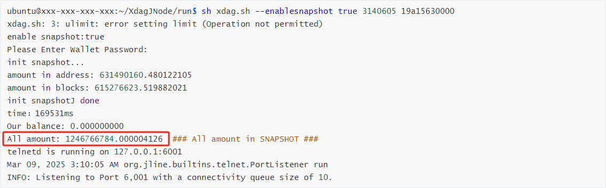
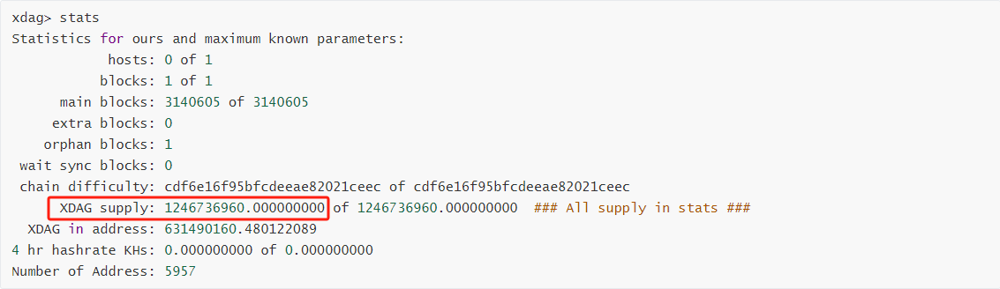

# **XdagJ Node 0.8.0 Run Document**


## System Environment

```bash
JDK : v21

GCC : Above v13.1.0

Maven : v3.9.1

MySQL : Above v8.0
```

### 1. Check if the current JDK version is JDK 21

```bash
$ java -version
```


### 2. Check if the current GCC version is v13.1.0 or above

```bash
$ gcc --version
```

- ***Upgrade GCC version to v13.1.0 or above:***

  - *Take Debian/Ubuntu as an example*

    - Add the official GCC toolchain PPA

      ```bash
      $ sudo add-apt-repository ppa:ubuntu-toolchain-r/test
      $ sudo apt update
      ```

    - Install gcc-13 and g++-13

      ```bash
      $ sudo apt install gcc-13 g++-13
      ```

    - Set gcc-13 as the default version

      After the installation is complete, in order to make the `gcc` and `g++` commands point to gcc-13 and g++-13 by default, you need to configure alternatives:

      ```bash
      $ sudo update-alternatives --install /usr/bin/gcc gcc /usr/bin/gcc-13 60
      $ sudo update-alternatives --install /usr/bin/g++ g++ /usr/bin/g++-13 60
      ```

      Then execute the following command to select which version to use by default (if you have multiple versions on your machine):

      ```bash
      $ sudo update-alternatives --config gcc
      ```

      You will be prompted to select a serial number, select the one that points to `/usr/bin/gcc-13`.

    - Verify Installation

      ```bash
      $ gcc --version
      $ g++ --version
      ```

      You should see the output:

      ```bash
      gcc (Ubuntu 13.x.x...) ...
      g++ (Ubuntu 13.x.x...) ...
      ```


### 3. Check if the current Maven version is v3.9.1 or above

```bash
$ mvn -v
```


### 4. Check if the current MySQL version is v8.0 or above

```bash
$ mysql -V
```


## Operation Steps

### **1. Clone Code**

- ***If the XdagJ project does not exist:***

  ```shell
  $ git clone https://github.com/XDagger/xdagj.git
  ```

- ***If the XdagJ project already exists:***

  ```shell
  $ cd xdagj 
  $ git pull
  ```

- ***Make sure the XdagJ project is in the master branch:***

  - *View the current branch*
  
    ```shell
    $ git branch
    ```
  
  - *Perform this operation when the current branch is not master*
  
    ```shell
    $ git checkout master
    ```
  
  

### **2. Configure MySQL**

- ***If you are configuring MySQL for the first time:***

  - *Install MySQL*

    ```shell
    # install MySQL.
    $ sudo apt install mysql-server
    ```

  - *Change password*

    - Log in to the MySQL database as the root user

      ```shell
      $ sudo mysql -u root
      ```

    - Change password

      ```mysql
      mysql> ALTER USER 'root'@'localhost' IDENTIFIED WITH mysql_native_password BY 'your_new_password';
      mysql> FLUSH PRIVILEGES;
      mysql> EXIT;
      ```

  - *Create a database for saving transaction history*

    - Log in to MySQL as the root user, using the password you just set

      ```shell
      $ mysql -u root -p
      ```
      
    - Create a database named your_store_transaction_history_database_name

      ```mysql
      mysql> CREATE DATABASE your_store_transaction_history_database_name;
      ```
      
    - Check if the database was created successfully

      ```mysql
      mysql> SHOW DATABASES;
      ```

  - *Create a table*

    - Select the database you just created
    
      ```mysql
      mysql> USE your_store_transaction_history_database_name;
      ```
      
    - Locate the **`mysql_create_table.sql`** script in the **`xdagj/script`** folder. Create table **`t_transaction_history`** under this database
    
      ```mysql
      mysql> source absolute_path_of_your mysql_create_table.sql script;
      
      # For example: "source /home/ubuntu/xdagj/script/mysql_create_table.sql;"
      ```
      
    - Check whether the table is created successfully
    
      ```mysql
      mysql> SHOW TABLES;
      ```

- ***If you have already configured MySQL and have run nodes before, please perform the following steps:***

  - *Login to MySQL*

    ```shell
    $ mysql -u root -p
    ```

  - *Back up previous versions of transaction history*

    - Select the database where you previously stored transaction history
  
      ```mysql
      mysql> USE your_store_transaction_history_database_name;
      ```
      
    - Back up previous versions of transaction history data
  
      ```mysql
      mysql> RENAME TABLE t_transaction_history TO transaction_history_v_0_7_2;  
      ```
  
  - *Re-create an empty t_transaction_history table*
  
    - Select the database where you previously stored transaction history
    
      ```mysql
      mysql> USE your_store_transaction_history_database_name;
      ```
    
    - Locate the **`mysql_create_table.sql`** script in the **`xdagj/script`** folder. Create table **`t_transaction_history`** under this database
    
      ```mysql
      mysql> source absolute_path_of_your mysql_create_table.sql script;
      
      # For example: "source /home/ubuntu/xdagj/script/mysql_create_table.sql;"
      ```
    
    - Check whether the table is created successfully
    
      ```mysql
      mysql> SHOW TABLES;
      ```


### **3. Execute mvn**

```shell
$ cd xdagj
$ mvn clean package -Dmaven.test.skip=true
```


### **4. Create "run" Folder and Modify the Configuration Files**

- ***If you have not created a "run" folder before, please follow the steps below:***

  - *Create a "run" folder:*

    ```shell
    # Create a run folder, which is usually in the same directory as the xdagj.
    $ mkdir run
    ```

  - *Copy the necessary files to the "run" folder:*

    ```
    Copy "xdag-mainnet.conf", "druid.properties", "log4j2.xml", "xdag.sh", "xdagj-0.8.0-executable.jar" to "run" folder. 
    
    - "xdag-mainnet.conf", "druid.properties", "log4j2.xml" are located in the xdagj/src/main/resources
    
    - "xdag.sh" is located in the xdagj/script
    
    - "xdagj-0.8.0-executable.jar" is located in the xdagj/target
    ```

  - *Modify the configuration files:*

    - Modify druid.properties

      ```
      - Modify the url in the druid.properties file to: jdbc:mysql://localhost:3306/your_store_transaction_history_database_name?
      autoReconnect=true&useUnicode=true&characterEncoding=utf-8&&serverTimezone=UTC
      
      - The user name is root, and the password is the password (your_new_password) set in the mysql configuration before.
      ```

    - Modify xdag-mainnet.conf

      ```bash
      - "node.whiteIPs": Determines which nodes, under which IP addresses, can communicate with this node (Please ask the community if "node.whiteIPs" needs to be updated, added or deleted).
      
      - "fund.address": Set fund.address = "PKcBtHWDSnAWfZntqWPBLedqBShuKSTzS" (Required: Without this address, miner rewards cannot be distributed).
      
      - "node.generate.block.enable": Set node.generate.block.enable = true for mining nodes and node.generate.block.enable = false for exchanges.
      
      - "randomx.flags.fullmem": Please set randomx.flags.fullmem = false.
      
      - "fund.ration" and "node.ration" are the ratios of foundation reward and block node reward, respectively.
      ```
    
      ```bash
      - node.reject.transaction.address is the address to be denied service.
      
    - pool.whiteIPs is the pool whitelist. If set to ["0.0.0.0"], any pool can access the node. Otherwise, only specified IPs are allowed.
      ```

    - Modify xdag.sh
    
      ```bash
      - XDAG_VERSION: Modify XDAG_VERSION to "0.8.0".
      ```

- ***If you have already created the "run" folder and run the node before, follow these steps:***

  ```bash
  - Copy xdagj-0.8.0-executable.jar to the run folder.
  
  - Modify the XDAG_VERSION in xdag.sh to XDAG_VERSION="0.8.0".
  
  - In xdag-mainnet.conf, set randomx.flags.fullmem = false.
  
  - Please ask the community if "node.whiteIPs" needs to be updated, added or deleted.
  ```

  

### **5. Download the SNAPSHOT File**

```bash
1. Create the /main/rocksdb/xdagdb directory under the run folder.

2. SNAPSHOT download address: https://storage.xdagpool.com/.

3. Unzip the compressed package to get a SNAPSHOT folder.

4. Delete all files except SNAPSHOT files in the run/mainnet/rocksdb/xdagdb directory.

5. Copy the unzipped SNAPSHOT file to mainnet/rocksdb/xdagdb in the root directory, overwriting the existing SNAPSHOT folder.
```


### **6. Make Snapshot (Developer node steps: Ignore if not relevant)**

```shell
###
Notice:
	1. Please make sure to update file "xdagj-0.8.0-executable.jar" before performing this step.
	2. Snapshot file "SNAPSHOT" will be generated in directory mainnet/rocksdb/xdagdb.
###

# Run the following command to make the snapshot.
$ cd run
$ sh xdag.sh --makesnapshot
```


### 7. Verify the Version of xdag.sh

```shell
# Run this command in the /run path to verify the version.
$ sh xdag.sh --version    // return: 0.8.0
```


### 8. Start XdagJ

```shell
###
Notice:
	1. If there is no wallet folder under the current mainnet directory, it will be created automatically when the node starts.
	2. The node and pool wallet addresses must be different; otherwise, rewards will not be issued.
###
```

```shell
# Run the following command to start the xdagj node.
$ cd run
$ sh xdag.sh --enablesnapshot true [Snapshot Height] [Timestamp]    // Check with the community for the correct command.

# For example: "sh xdag.sh --enablesnapshot true 3140605 19a15630000" (Check with the community for the correct command).
```

**Notice:** If an exception occurs when starting the snapshot, delete the loaded data from **`t_transaction_history`** in MySQL. Ensure the table is empty before restarting. Also, delete all non-SNAPSHOT files in **`rocksdb/xdagdb`**.


### **9. Verify MySQL Data**

- ***Verify whether the data is successfully written to MySQL:***

  ```shell
  # Login to MySQL.
  $ mysql -u root -p
  ```

  ```mysql
  ###
  1. Run the following command to verify whether the data is successfully written to MySQL.
  2. If the data amount is greater than 0, it means that it has been successfully written to MySQL.
  ###
  mysql> USE you_database_name;
  mysql> SELECT COUNT(*) FROM t_transaction_history;
  ```


### 10. Verify SNAPSHOT Data and Check the Node State ###

- ***Verify SNAPSHOT data:***

  - *This is an example of a successful node startup result:*

    

  - *This is an example of the output of the "stats" command right after the snapshot has been loaded:*

    

  - *Verify SNAPSHOT all balance:*

    ```shell
    x: All amount in SNAPSHOT, printed out after the snapshot is loaded
    
    y: All supply in stats
    
    y = x - 466 * 64  
    
    ### 
    	example:
    		x (All amount) = 1246766784.000004126
    	
    		y (XDAG supply) = 1246736960.000000000
    	
    		y = x - 466 * 64  =>  1246736960 = 1246766784 - 466 * 64
    ###
    ```

- ***Check the node status by using the telnet:***

  - *Start telnet:*

    - Run the following command to use telnet

      ```shell
      $ telnet 127.0.0.1 6001
      ```

    - Enter the password, the password is admin.telnet.password in xdag-mainnet.conf

      ```shell
      Enter Admin password>[Your password]
      ```

  - *List all methods in telnet:*

    ```shell
    xdag> help
    ```

  - *Check the state of the node:*

    ```shell
    xdag> state
    ```

    **Notice:** If the returned result is **`Synchronized with the main network. Normal operation.`**, it indicates that synchronization is complete and block generation is functioning normally. At this point, your node has been successfully set up and synchronized with the mainnet.

  - *View the statistics of the node:*

    ```shell
    xdag> stats
    ```

    

  

